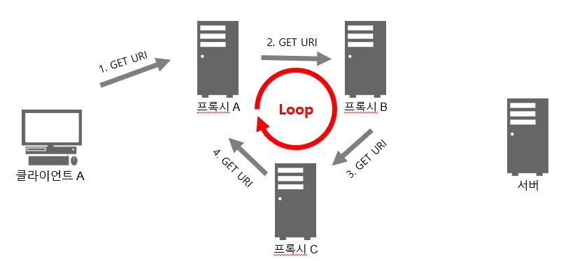

# 그림책 #6

Assignee: Soohh
Study: Network

# HTTP 헤더

> HTTP 메세지를 구성하는 요소의 하나
> 클라이언트-서버 HTTP 통신에서 리퀘스트와 리스폰스에 사용
> 메세지 바디의 크기나 사용하는 언어, 인증 정보 등을 브라우저나 서버에 제공

들어가기 앞서

[HTTP Message](https://velog.io/@koseungbin/HTTP-Message)

## HTTP 헤더 필드의 구조

헤더 필드명 : 필드 값(여러 개 가능)

**End-to-end**

헤더가 리퀘스트는 서버, 리스폰스는 클라이언트라는 최종 수신자에게 전송된다.

중간에 프록시가 있을 경우 헤더를 수정하지 않은 상태로 재전송 해야한다. 

**Hop-by-hop**

한 번 전송에 대해서만 유효하다. 중간에 캐시서버 혹은 프록시 서버가 있을 경우 최종 목적지까지 전송되지 않는 것도 있다. Hop-by-hop 헤더는 Connection 헤더 필드에 열거해야 한다.
아래 8개의 헤더 필드 이외에는 모두 End-by-end 헤더에 분류된다.

- Connection
- Keep-Alive
- Proxy-Authenticate
- Proxy-Authorization
- Trailer
- TE
- Transfer-Encoding
- Upgrade

## HTTP 헤더 필드의 종류

### 일반 헤더 필드 (General Header Fields)

> 리퀘스트 메세지와 리스폰스 메세지 양쪽에서 사용되는 헤더

**Cache-Control**

- 일반적으로 GET 요청에 대해, 웹에서는 주로 정적 리소스(HTML, CSS, JS, 이미지, 비디오 파일 등)
- no-cache: 캐시는 하지만 항상 유효한지 오리진 서버에 확인한다.
  no-store: 아예 캐시하지 않는다.
- max-age: 최대 유효 시간(초 단위)
  age : max-age 시간 내에서 얼마나 흘렀는지 (초 단위)
- max-age, Expires 가 같이 달린 경우 max-age가 우선된다.
- min-fresh : 최소 이 시간만큼은 살아있어야 한다.


[웹 서비스 캐시 똑똑하게 다루기](https://toss.tech/article/smart-web-service-cache)

[Cache-Control - HTTP | MDN](https://developer.mozilla.org/ko/docs/Web/HTTP/Headers/Cache-Control)

[HTTP caching - HTTP | MDN](https://developer.mozilla.org/ko/docs/Web/HTTP/Caching)

**Connection**

- 프록시에 더 이상 전송하지 않는 헤더 필드를 지정
- 지속적 접속 관리 - Keep-Alive  (HTTP 1.1 디폴트)

**Transfer-Encoding**

- 메세지 바디의 전송 코딩 형식 지정
- 실제로 chunked 만 사용됨 (HTTP 1.1)

**Upgrade**

- HTTP 1.1에서만 허용
- HTTP 1.1 과 HTTP 2.0, HTTP 1.1 과 웹소켓 통신 처럼 서로 다른 프로토콜을 사용하는 경우
- Upgrade 헤더 사용 시 반드시 Connection: Upgrade 헤더 필드 지정

**Via**

- 리퀘스트 및 리스폰스 메세지의 경로 나타냄
- 프록시 서버를 경유하는 경우 지정 필요 (추적 및 루프 회피 등 탐색)
- HTTP TRACE 메서드와 함께 자주 사용됨



### 리퀘스트 헤더 필드 (Request Header Fields)

> 리퀘스트 메세지에 사용되는 헤더
> 리퀘스트의 부가 정보와 클라이언트의 정보, 리스폰스 콘텐츠에 관한 우선 순위등을 추가

**Accept**

- 유저 에이전트에 처리할 수 있는 미디어 타입과 그 우선 순위를 전달
- text/html, text/plain, text/*
- 디폴트는 Accept: */*
- 복수의 콘텐츠를 반환할 경우 품질계수(q) 높은 것으로 반환

```markdown
accept: text/html,application/xhtml+xml,application/xml;q=0.9,
image/avif,image/webp,image/apng,*/*;q=0.8,application/signed-exchange;q=0.9
```

**Accept-Charset**

- 유저 에이전트가 처리할 수 있는 문자셋과 우선순위 전달

**Accept-Encodin**g

- 유저 에이전트가 처리할 수 있는 콘텐츠 코딩과 우선순위 전달

**Accept-Language**

- 유저 에이전트가 처리할 수 있는 자연어 세트와 우선순위 전달

**Authorization**

- 유저의 인증정보 전달
- 서버에서 401 Unauthorized가 내려오면 클라이언트에서 Authorization 헤더 필드를 포함해 전송

**Expect**

- 가능한 지 확인
- 서버에서는 가능한 경우 100-continue를 보내고, 안될 경우 417 Expectation Failed 반환
- 현재 100-continue를 제외한 다른 값은 정의되어 있지 않음.

```
PUT /somewhere/fun HTTP/1.1
Host: origin.example.com
Content-Type: video/h264
Content-Length: 1234567890987
Expect: 100-continue
```

**Host**

- 리퀘스트한 리소스의 인터넷 호스트와 포트 번호 (서버의 도메인명과 포트)
- HTTP 1.1에서 유일한 필수 헤더
- 복수의 도메인이 할당된 경우가 있어 어디로 요청하는지 명확하게 Host로 나타냄

**If-xxx**

- 조건부 리퀘스트. 지정된 조건에 맞아야 서버에서 리퀘스트를 받아들임
- If-Match: Etag의 값이 일치할 때 / 412 Precondition Failed
- If-Modified-Since: 지정된 날짜 이후 갱신된 리소스일 때 / 304 Not Modified
- If-None-Match: Etag의 값이 일치하지 않을 때
- If-Range: Etag 혹은 날짜를 보내 일치하면 Range 리퀘스트로 처리 / 불일치 시 리소스 전체 반환
- If-Unmodified-Since: 지정된 날짜 이후 갱신되어 있지 않은 경우 / 412 Precondition Failed

**Max-Forwards**

- 경유할 수 있는 서버의 최대 개수 지정
- 여러 개의 프록시 서버를 거칠 때 문제가 발생하는 경우 추적 시 사용

**Proxy-Authorization**

- 유저 인증정보 전달
- 클라이언트와 프록시 서버 사이의 인증

**Range**

- 범위를 지정해 리소스의 일부분만 취득
- 요청한 부분만 응답 가능한 경우 206 Partial Content
  불가능한 경우 200 OK 로 전체 리소스 반환

**Referer**

- 현재 요청을 보낸 페이지의 절대 혹은 부분 주소
- "어디로부터 와서 방문 중인지를 인식할 수 있도록 해주며 해당 데이터는 예를 들어, 분석, 로깅, 혹은 캐싱 최적화에 사용될 수도 있습니다."

**TE**

- 리스폰스로 받을 수 있는 전송 코딩의 형식과 우선 순위 전달

**User-Agent**

- 리퀘스트를 생성한 유저 에이전트 정보 전달

### 리스폰스 헤더 필드 (Response Header Fields)

> 서버에서 클라이언트로 송신되는 리스폰스 메세지에 적용된 헤더
> 리스폰스의 부가 정보, 서버 정보, 클라이언트에 부가정보 요구 등을 나타냄

**Accept-Ranges**

- Range 리퀘스트에 대해 가능한 경우 bytes, 불가능한 경우 none

**Age**

- 서버로부터 리스폰스가 생성된 후 경과한 시간. 초단위
- 캐시 서버의 경우 캐싱된 후 경과한 시간

**Etag**

- 엔티티 태그. 리소스 마다 부여. 일종의 해시값
- 리소스가 갱신되면 Etag도 변경됨
- 유효성 검증 시 사용
- 강한 Etag: 아주 조금 다르더라도 값이 변경됨. 바이트 대 바이트로 동일한지 보장
- 약한 Etag: 리소스가 같음. "W/" 가 붙음.

[HTTP 조건부 요청 - HTTP | MDN](https://developer.mozilla.org/ko/docs/Web/HTTP/Conditional_requests)

**Location**

- 요청 URI 이외의 리소스 엑세스를 유도하는 경우
- 주로 3xx Redirection 시 리다이렉트 될 URI 기술

**Proxy-Authenticate**

- 프록시 인증 요구를 클라이언트에 전달

**Retry-After**

- 지정된 시간 후 다시 요청해 줄 것을 전달
- 주로 503 Service Unavailable, 3xx Redirect와 함께 사용
- 대부분의 브라우저에서 무시됨. Googlebot 과 같은 몇몇 크롤러들은 지킴

**Server**

- HTTP 서버의 정보(이름, 버전 등) 전달
- 너무 길고 상세한 서버의 정보는 공격을 받을 수 있음

**Vary**

- 캐시를 컨트롤 할 때 사용
- 예를 들어 Vary: User-Agent 인 경우, 프록시 서버는 동일한 리소스에 대한 요청이더라도 User-Agent가 다른 경우 프록시 서버에 캐싱된 데이터가 아닌 오리진 서버로 부터 새로 리스폰스를 받아야 함

**WWW-Authenticate**

- 401 Unauthorized 발생 시 포함됨
- 클라이언트에 인증 스키마와 파라미터 전달

**Access-Control-Allow-XXX**

- Access-Control-Allow-Credentials: 클라이언트에서 요청 시 withCredentials: true 필요
  withCredentials이 false 일 경우, 타 origin 간 쿠키, 인증 정보등이 전달되지 않음.
- Access-Control-Allow-Origin: 리스폰스가 허용되는 origin 정보 기술. 브라우저는 기본적으로 SOP 정책을 따르기 때문에, 이 헤더에 맞는 origin이 아니라면 CORS 에러 발생.
- Access-Control-Allow-Methods: 허용되는 HTTP 메서드 지정
- Access-Control-Allow-Headers: 서로 다른 Origin 일 때, [CORS-safelisted_request_header](https://developer.mozilla.org/en-US/docs/Glossary/CORS-safelisted_request_header)에 속하지 않은 헤더는 기본적으로 거부됨. 이때, Access-Control-Allow-Headers로 지정해 준다면 허용 가능. (IE 브라우저 지원 시 종종 필요)

### 엔티티 헤더 필드 (Entity Header Fields)

> 리퀘스트 메세지와 리스폰스 메세지에 포함된 엔티티에 사용되는 헤더
> 콘텐츠 갱신 시간 등 엔티티에 관한 정보 포함

**Allow**

- 405 Method Not Allowed 와 함께 허용 가능한 메서드 목록 반환

**Content-Encoding**

- 서버가 엔티티 바디에 대해 실시한 콘텐츠 코딩 형식 전달
- gzip, compress, deflate, identity

**Content-Language**

- 엔티티 바디에 사용된 자연어 전달

**Content-Length**

- 엔티티 바디의 크기 전달. byte 단위

**Content-Location**

- 메세지 바디에 대응하는 URI 전달
- 리소스 접근에 필요한 직접적인 URL

**Content-MD5**

- 메세지 바디에 MD5 암호화 + Bse64 인코딩
- [RFC 7231](https://datatracker.ietf.org/doc/html/rfc7231#page-91) 에서 removed (2014.06)

**Content-Range**

- Range 리퀘스트에 대한 리스폰스 시 사용
- 응답 엔티티의 범위 및 전체 사이즈를 byte 단위로 전달

**Content-Type**

- 엔티티 바디에 포함되는 객체의 미디어 타입

**Expires**

- 리소스의 유효 기간 날짜 전달
- 캐시 서버는 해당 날짜까지 캐시 데이터를 유지하고, 날짜가 지나면 클라이언트에서 요청이 들어올 때 오리진 서버에 리소스를 요청
- Cache-Control에 max-age가 있는 경우 max-age가 우선됨.

**Last-Modified**

- 리소스가 마지막으로 갱신된 날짜

### 쿠키를 위한 헤더 필드

> 쿠키는 유저 식별과 상태 관리에 사용됨
> 현재 가장 잘 사용되는 쿠키 사양은 넷스케이프사에 의한 사양

**Set-Cookie**

- 서버→클라이언트
- 서버에서 클라이언트에 대해 상태관리를 위해 다양한 정보 전달
- 대표적으로 톰캣이 내려주는 jsessionid

**Cookie**

- 클라이언트→서버
- 서버에서 받은 쿠키를 이후 리퀘스트에 포함해서 전달

### 기타 헤더 필드

**X-Frame-Option**

- 다른 웹 사이트의 프레임에서 표시를 제어
- 클릭 재킹(웹 사용자가 자신이 클릭하고 있다고 인지하는 것과 다른 어떤 것을 클릭하게 속이는 악의적인 기법) 공격 막는 목적
- 예를 들어 <iframe src="www.google.com"></iframe> 일 때, google.com은 x-frame-option=SAMEORIGIN 이기 때문에 타 도메인의 경우 표시되지 않음

[XSS 공격](https://kevinthegrey.tistory.com/36)
