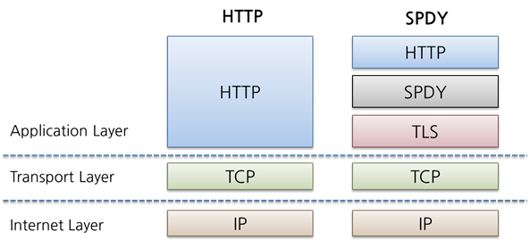

# 그림책 #9, #10

Assignee: yun0 hong
Study: Network

# 9. HTTP에 기능을 추가한 프로토콜

HTTP는 쏘 심플한 프로토콜이라 다양한 기능을 추가하려면 애플리케이션이나 스크립트 등으로 구현해야하는데 그럴경우 효율성에 한계가 있다.

그래서 HTTP를 기반으로 해서 여기에 추가하는 형태로 새로운 프로토콜들이 구현되었다.

## HTTP의 병목 현상을 해소하는 SPDY

구글의 SPDY(스피디)의 목표 : 병목 현상을 해소하고 웹 페이지 로딩 시간을 50% 단축한다!

[https://www.chromium.org/spdy](https://www.chromium.org/spdy)

[https://d2.naver.com/helloworld/140351](https://d2.naver.com/helloworld/140351)

DEPRECATED??!!!??!!!!! → HTTP2

**병목 현상을 일으키는 HTTP의 특징**

- 1개의 커넥션으로 1개의 리퀘스트만 보낼 수 있다.
- 클라이언트에서만 리퀘스트를 보낼 수 있다. 서버가 마음대로 정보를 줄 수 없다.
- 헤더가 장황하고 압축되지 않았다.
- 같은 헤더여도 매번 보내야 한다.
- 데이터 압축이 강제적이지 않다.

### Ajax

**해결된 점** : 웹 페이지의 일부분만 갱신할 수 있다.

**단점** : 실시간으로 갱신하려면 대량의 리퀘스트가 발생한다.

### Comet

응답을 연장시키는 방식으로 서버 푸시와 비슷한 방식으로 동작할 수 있도록 하는 기술들을 지칭하는 용어이다.

- Polling
- Long-polling
- Streaming
- Hidden iframe

**해결된 점** : 서버에서 콘텐츠가 갱신되면 바로 클라이언트에 반영할 수 있다.

**단점** : 커넥션 유지 시간이 길어진다. → 리소스 소비

### SPDY 설계와 기능

TCP/IP의 애플리케이션 계층과 트랜스포트 계층 사이에 세션 계층을 추가하는 형태

표준으로 SSL을 사용

[https://d2.naver.com/helloworld/140351](https://d2.naver.com/helloworld/140351)

`다중화 스트림` : 단일 TCP 커넥션으로 복수의 HTTP 리퀘스트를 무제한으로 처리

`우선 순위 부여` : 리퀘스트가 무제한으로 병렬 처리 될 때, 각 리퀘스트에 우선 순위를 할당할 수 있다.

`HTTP 헤더 압축`

`서버 푸시` : 클라이언트의 리퀘스트를 기다리지 않고 서버에서 데이터를 보낼 수 있다.

`서버 힌트` : 서버가 클라이언트에게 리퀘스트 해야 할 리소스를 제안

### SPDY는 웹의 병목 현상을 해결하는가?

SPDY는 한 개의 도메인(IP 주소)과의 통신을 다중화할 뿐이기 때문에 하나의 웹 사이트에서 복수의 도메인으로 리소스를 사용하고 있는 경우에는 그 효과가 한정적이다.

대부분 웹 사이트의 문제는 HTTP의 병목 현상 때문만은 아니어서, 그 외 부수적인 성능 개선이 필요하다.

## 브라우저에서 양방향 통신을 하는 WebSocket

 

### WebSocket의 설계와 기능

웹 브라우저와 웹 서버를 위한 양방향 통신 규격

WebSocket 프로토콜 : IETF가 책정

WebSocket API : W3C가 책정

XMLHttpRequest의 결점을 해결하기 위한 기술

### WebSocket 프로토콜

웹 서버와 클라이언트가 한번 접속을 확립하면 그 뒤의 통신을 모두 전용 프로토콜로 하는 방식

JSON, XML, HTML, 이미지 등 임의 형식의 데이터를 전송

HTTP에 의한 접속의 출발점이 클라이언트에 있다는 것에는 변함이 없다.

한 번 접속을 확립하면 서버와 클라이언트 어느 쪽에서도 송신을 할 수 있다.

`서버 푸시 기능` : 서버가 클라이언트의 리퀘스트를 기다리지 않고 데이터 전송

`통신량 절감` : 접속 오버헤드가 적고, 헤더의 사이즈도 작다. WebSocket을 위한 핸드쉐이크 절차가 필요

**핸드쉐이크/리퀘스트**

HTTP의 Upgrade 헤더 필드를 사용해서 프로토콜을 변경하는 것으로 핸드쉐이크를 실시

`Sec-WebSocket-Key` : 핸드쉐이크에 필요한 키

`Sec-WebSocket-Protocol` : 서브 프로토콜. WebSocket 프로토콜 커넥션을 여러 개로 구분하고 싶을 때.

**핸드쉐이크/리스폰스**

앞선 핸드쉐이크 리퀘스트에 대한 리스폰스의 상태코드는 101 Switching Protocols로 반환

`Sec-WebSocket-Accept` : `Sec-WebSocket-Key`의 값에서 생성된 값

WebSocket 커넥션이 확립된 후에는 HTTP가 아닌, WebSocket의 독자적인 데이터 프레임을 이용해 통신

**WebSocket API**

JavaScript에서 WebSocket 프로토콜로 양방향 통신을 하기 위해서는 W3C에서 제공되는 WebSocket 인터페이스를 사용해야 한다.

## HTTP/2.0

사용자가 웹을 이용할 때의 체감 속도의 개선이 목표

HTTP/1.1 경유로 TCP를 사용하는 것이 기본

**베이스 프로토콜**

- SPDY
- HTTP Speed+Mobility
  - 마이크로소프트 사가 제안하는 모바일 통신 속도와 효율성 개선을 위한 규약
  - SPDY, WebSocket이 근원
- Network-Friendly HTTP Upgrade
  - 주로 모바일 통신에서 HTTP의 효율 개선을 위한 규격

[https://developers.google.com/web/fundamentals/performance/http2?hl=ko](https://developers.google.com/web/fundamentals/performance/http2?hl=ko)

## 웹 서버 상의 파일을 관리하는 WebDAV

웹 서버의 콘텐츠에 대해서, 직접 파일 복사나 편집 작업 등을 할 수 있는 분산 파일 시스템

- 파일 작성, 삭제
- 파일 작성자 등의 관리
- 편집 중에 다른 유저가 다시 고쳐 쓰지 못하도록 잠금 기능
- 갱신 정보를 관리하는 리비전 기능

HTTP/1.1의 PUT 메소드, DELETE 메소드를 사용해 웹 서버 상의 파일 작성이나 삭제 등을 할 수 있지만 보안이나 편의성 등의 문제로 사용되지 않는다.

### HTTP/1.1을 확장한 WebDAV

**WebDAV에서 새롭게 추가한 개념**

- 컬렉션(Collection) : 여러 개의 리소스를 한꺼번에 관리하기 위한 개념
- 자원(Resource) : 파일이나 컬렉션
- 프로퍼티(Property) : 리소스의 프로퍼티. "이름=값"의 형식
- 잠금(Lock) : 파일을 편집할 수 없는 상태로 만든다. 동시 수정을 예방.

**WebDAV에서 추가된 메소드**

- PROPFIND : 프로퍼티 취득
- PROPPATCH : 프로퍼티 변경
- MKCOL : 컬렉션 작성
- COPY : 리소스 및 프로퍼티 복제
- MOVE : 리소스 이동
- LOCK : 리소스 잠금
- UNLOCK : 리소스 잠금 해제

**WebDAV에서 추가된 상태 코드**

- 102 Processing : 리퀘스트는 정상 수신되었지만 아직 처리 중
- 207 Multi-Status : 복수의 스테이터스를 가지고 있다.
- 422 Unprocessable Entity : 서식은 올바르지만 내용이 틀리다.
- 423 Locked : 리소스가 잠김
- 424 Failed Dependency : 관련 리퀘스트가 실패했기 때문에 의존 관계를 유지할 수 없다.
- 507 Insufficient Storage : 저장 공간 부족

---

# 10. 웹 콘텐츠에서 사용하는 기술

## HTML

HyperText Markup Language

HyperText : 링크되어 있는 문서

Markup Language : 문서 일부에 특정 문자열을 붙여 문서를 수식하는 언어. → HTML에서는 HTML 태그

HTML5는 2014년 정식 발표

브라우저에 따라 HTML 사양에 따르지 않거나 독자적인 태그를 확장하는 경우가 있어 사실상 HTML 규격은 아직도 통일되지 않은 상태

### CSS

스타일 시트라고 불리능 사양 중의 하나

문서 구조와 디자인을 분리한다는 이념에서 만들어졌다.

## 다이나믹 HTML

### 웹 페이지를 동적으로 변경하는 다이나믹 HTML

정적인 HTML 내용을 클라이언트 사이드 스크립트를 사용해서 동적으로 변경하는 기술

### HTML을 조작하기 쉽게 해주는 DOM

DOM(Document Object Model)은 HTML 문서와 XML 문서를 위한 API

DOM을 사용하면 HTML 내의 요소를 오브젝트로 다룰 수 있기 때문에 요소 내의 문자열을 추출하거나 CSS를 프로퍼티로서 변경해 디자인을 변경할 수 있다.

JavaScript 등의 스크립트를 사용하여 HTML을 쉽게 조작할 수 있다.

## 웹 애플리케이션

### 웹을 사용해서 기능을 제공하는 웹 애플리케이션

웹 기능을 사용해서 제공되는 프로그램

원래 HTTP 웹구조는 사전에 준비된 콘텐츠를 클라이언트의 리퀘스트에 맞게 반환하는 것

이것만으로는 부족해서 프로그램이 HTML 등의 콘텐츠를 생성할 필요가 생겼다.

동적 콘텐츠 : 프로그램에 의해 생성된 콘텐츠. 웹 애플리케이션.

정적 콘텐츠 : 사전에 준비된 콘텐츠

### 웹 서버와 프로그램을 연계하는 CGI

CGI(Common Gateway Interface) : 웹 서버가 클라이언트에서 받은 리퀘스트를 프로그램에 전달하기 위한 구조

Perl, PHP, Ruby, C 등의 프로그래밍 언어에서 사용

### Java에서 보급된 서블릿

서블릿(Servlet) : 서버 상에 HTML 등의 동적 콘텐츠를 생성하기 위한 프로그램

JavaEE(Java Enterprise Edition)의 일부

서블릿은 CGI의 문제점을 해결하는 기술로서 Java와 함께 보급되었다.

CGI는 리퀘스트마다 프로그램을 기동하기 때문에 대량 액세스 시 웹 서버에 부하가 걸림

→ 서블릿은 웹 서버와 같은 프로세스 속에서 동작하기 때문에 비교적 부하가 적음. (그 외 mod_perl)

서블릿 컨테이너 : 서블릿의 실행 환경

## 데이터 송신에 이용되는 포맷이나 언어

### 범용적으로 사용할 수 있는 마크업 언어 XML

XML(eXtensible Markup Language)

목적에 맞게 확장 가능한 범용적으로 사용할 수 있는 마크업 언어

인터넷을 통해 데이터 공유를 용이하게 하는 것을 목적으로 함

HTML과 같은 문서 기술 언어(SGML, Standard Generalized Markup Language)에서 파생된 것이지만 HTML에 비해 데이터를 기술하는 것에 특화되어 있다.

태그를 사용한 트리 구조

데이터 추출과 데이터 재사용이 쉽다.

데이터 교환 포맷으로서 서로 다른 애플리케이션 사이에서 이용되기도 한다.

### 갱신 정보를 송신하는 RSS/Atom

RSS와 Atom은 뉴스나 블로그의 기사 등의 갱신 정보를 송신하기 위한 문서 포맷의 총칭

XML을 이용

RSS

- RSS 0.9 (RDF Site Summary) : 최초. RDF 구문 사용.
- RSS 0.91 (Rich Site Summary) : 요소 확장 목적. 독자적인 XML 사용.
- RSS 1.0 (RDF Site Summary) : RSS 규격이 혼란한 중에 다시 RDF 구문으로 릴리즈.
- RSS 2.0 (Really Simple Syndication) : RSS 1.0 노선과는 별도로 RSS 0.91 호환성을 위해 개발.

Atom

- Atom 전송 포맷(Atom Syndication Format) : 콘텐츠를 전송하기 위한 피드의 포맷. 단순히 Atom이라고 하면 이 포맷을 가리킨다.
- Atom 출판 프로토콜(Atom Publishing Protocol) : 웹 상의 콘텐츠를 편집하기 위한 프로토콜

RSS 리더 애플리케이션에서는 대부분 RSS의 각종 버전과 Atom이 제공된다.

### JavaScript에서 이용하기 쉽고 가벼운 JSON

JSON(JavaScript Object Notation)

경량 데이터 기술 언어

JavaScript(ECMAScript) 오브젝트 표기법을 바탕으로 한다.

다룰 수 있는 데이터형 : false, null, true, 오브젝트, 배열, 수치, 문자열

단순하고 가볍게, 문자열을 JavaScript에서 간단하게 읽어올 수 있다는 점에서 Ajax에서 XML 대신 널리 이용하게 됨

여러 프로그래밍 언어에서 JSON을 쉽게 다루기 위한 라이브러리들이 마련됨

---

# 과제

## Web으로 Server Push를 구현하는 방법에 대해 설명하세요.

- Polling : 짧은 간격으로 계속 리퀘스트를 보내 새로운 이벤트가 발생했는지 확인하는 방법
- Long-polling : 새로운 이벤트가 발생할 때까지 응답을 보류하다가 이벤트 발생 시 응답하는 방법
- Streaming : 연결을 끊지 않고 응답 스트림을 통해 지속적으로 데이터를 전송하는 방법
- Hidden iframe : 숨겨진 iframe태그를 통해 접속을 유지하는 방법

## Socket.io와 WebSocket의 차이에 대해 설명하세요.

Socket.io는 각 브라우저에서 사용 가능한 방식을 내부적으로 선택하여 클라이언트와 서버의 양방향 통신을 가능하게 해주는 모듈이다.

브라우저가 HTML5를 지원한다면, 내부적으로 WebSocket이 선택되어 사용된다.

[https://d2.naver.com/helloworld/1336](https://d2.naver.com/helloworld/1336)
